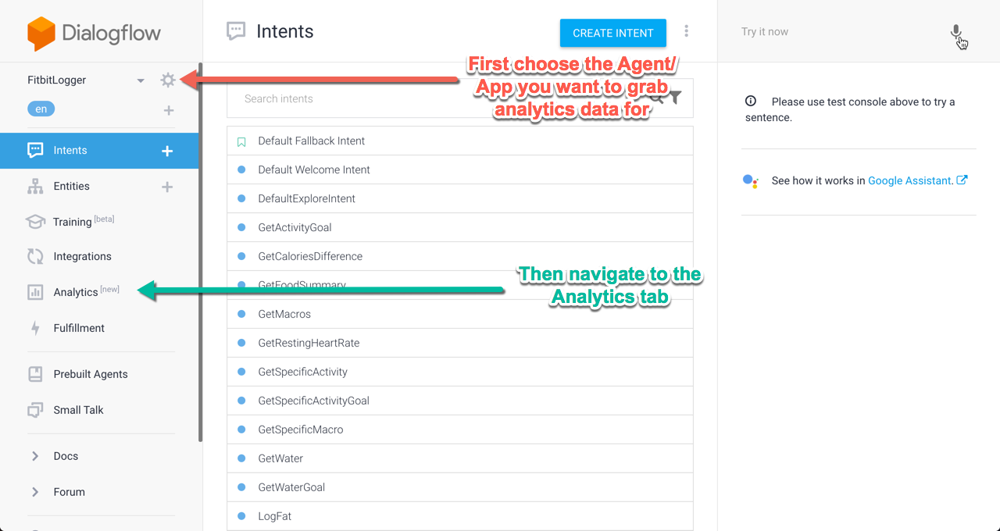
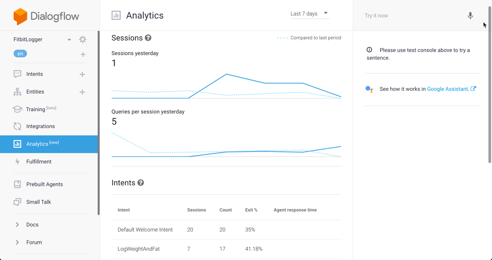
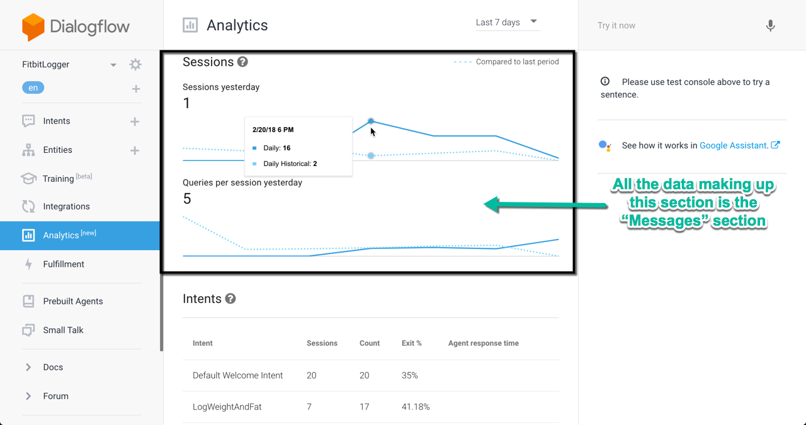
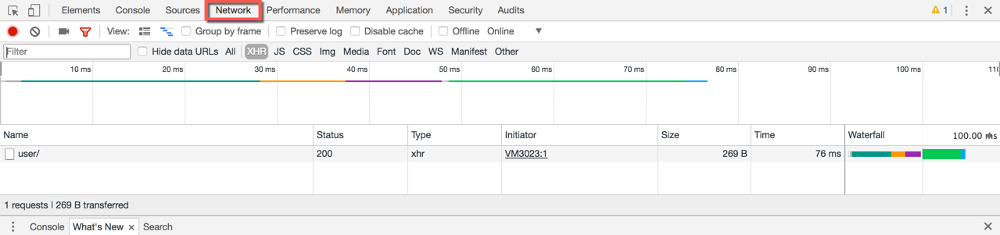
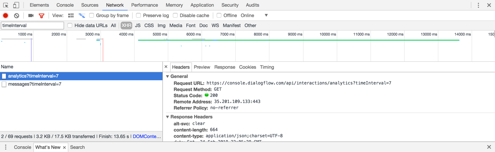
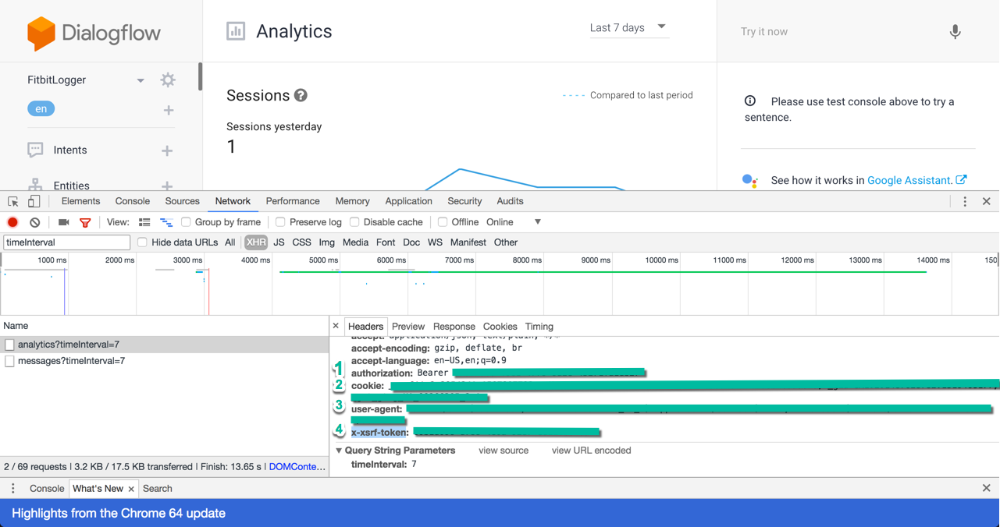

# Flowlytics 
A small wrapper around the unpublished Dialogflow Analytics API

## Installation
Run in your terminal
```
npm install --save flowlytics
```

## Grabbing Your Tokens
1) First to grab the tokens you'll need, sign into the [Dialogflow console](https://console.dialogflow.com)
2) Navigate to the correct agent and Analytics tab

3) Here's what the Analytics tab looks like when signed in. Our goal is get rid of having to sign into this and grab this data through their API.

4) The top part of your screen with sessions and the graphs of your sessions and queries/messages over time. This will be known as the Messages Object.

5) To actually grab your tokens, open the [dev tools](https://developer.mozilla.org/en-US/docs/Learn/Common_questions/What_are_browser_developer_tools) in your respective browser
6) Navigate to the Network tab

7) In order to get the tokens we need, we need to watch the API calls come in for that data, so refresh the page
8) Close to the bottom of your network traffic, or if you search/filter by "timeInterval", you'll see the two API calls grabbing the analytics data

9) Click on one of them, scroll down on the right to the Request Headers, and you'll want to grab the tokens for: "authorization", "cookie", "user-agent", and "x-xsrf-token".

10) Congrats, you've grabbed your tokens and can now drop them in the configuration step below.
```NOTE: As of this writing, I haven't figured out how to automatically refresh the tokens, so they will expire every 7 days and you'll have to sign back in and grab the new one's to drop in your app.```

## Configuration
To configure the API for an authenticated request, drop your tokens in their respective fields in the tokens object down below
```
// The tokens you grabbed in the Grabbing Tokens step above
var tokens = {
    "xsrf": xsrf_token,
    "user_agent": user_agent,
    "cookie": cookie,
    "auth": auth,
};
```
Dialogflows Analytics tab only lets you see data for the past 1,7, or 30 days, however you can actually use any number of days of your choosing
```
// The length of the interval of days you want to grab analytics data for
var interval_in_days = 7;
```

## Basic Usage

```
// Importing the module
var Flowlytics = require("flowlytics");

var tokens = {
    "xsrf": "YOUR_XSRF_HERE",
    "user_agent": "DESIRED_USER_AGENT",
    "cookie": "COOKIE",
    "auth": "YOUR_AUTH_BEARER_TOKEN",
};

var interval_in_days = 7;

Flowlytics( tokens, interval_in_days ).then( function( resp ) {
    // Messages and Analytics are the returned objects from their respective calls
    var messages = resp.messages;
    var analytics = resp.analytics;

} );
```

### Messages and Analytics Object
Dialogflow's API calls return data for the Messages tab, and the Analytics section. Below is the data model and each property you can access for each.

#### Analytics
Object being accessed when you do resp.analytics
```
{
    next_cursor: 50,
    // an array containing following data for every intent
    rows: [
        {
            // Percent that users exit an intent
            "exit_rate": 0.11059907834101383,
            // Historical rate that users exist an intent
            "exit_rate_historical": 0.13513513513513514,
            // Name of your intent
            "intent": "LogWater",
            // Optional and only comes back on intents not using the webhook
            "message_groups_agent_response_time": {
                // Median agent response time(in seconds)
                "50_percent": 0.111,
                // 90% agent response time(.1459s)
                "90_percent": 0.14599999999999999
            },
            // Total count of messages sent for an intent. Basically the number of messages users sent to use that
            // intent Ratio of count to message groups count becomes much higher if you don't close the app after an
            // intent
            "message_groups_count": {
                // They unfortunately only return a current property
                "current": 217
            },
            // Total number of times users entered into that intent
            "message_groups_users_count": {
                // They unfortunately only return a current property here
                "current": 35
            }
        },
    ]
};
```

#### Messages
Object being accessed when you access resp.messages
```
{
    // Holds the raw data as well as aggregated versions of the average messages per user
    "average_messages_per_user": {
        "24": {
            // List of current averages messages per user per day to calculate the aggregate below
            "current": [
                5.2142857142857144,
                6.36231884057971,
                5.903225806451613,
            ],
            // List of historical averages messages per user per day to calculate the aggregate below
            "historical": [
                3.5,
                4.893129770992366,
                5.720430107526882,
            ]
        },
        // Aggregated averages messages per user for the given time length(in days)
        "aggregated": {
            "current": 5.7770270270270272,
            "historical": 5.563380281690141
        }
    },
    // Timestamps at midnight GMT of days your app was used
    "human_timestamps": [
        "2018-02-18T00:00:00",
        "2018-02-19T00:00:00",
        "2018-02-20T00:00:00",
    ],
    // Number of users who've used your app
    "num_users": {
        "24": {
            // List of current users per day to calculate the aggregate below
            "current": [
                14,
                69,
                31,
            ],
            // List of historical users per day to calculate the aggregate below
            "historical": [
                2,
                131,
                93,
            ]
        },
        // Aggregated users count for the given time length(in days)
        "aggregated": {
            // Current number of users in this past {daysAgo}
            "current": 114,
            // Historical number of users over the # of days interval
            "historical": 226
        }
    },
    // Status of the response
    "status": 200,
    // same as human_timestamps, but in time since epoch
    "timestamps": [
        1518912000,
        1518998400,
        1519084800,
    ]
};
```

### More examples
```
// Importing the module
var Flowlytics = require("flowlytics");

var tokens = {
    "xsrf": "YOUR_XSRF_HERE",
    "user_agent": "DESIRED_USER_AGENT",
    "cookie": "COOKIE",
    "auth": "YOUR_AUTH_BEARER_TOKEN",
};

var interval_in_days = 7;

Flowlytics( tokens, interval_in_days ).then( function( resp ) {
    var messages = resp.messages;

    console.log(messages.num_users.aggregated.current);
    // 114 current users in the last 7 days

    console.log(messages.average_messages_per_user.aggregated.current);
    // 5.77 messages per user over the last 7 days

    var analytics = resp.analytics;
    var first_intent_analytics = analytics.rows[0];

    console.log(first_intent_analytics.intent);
    // LogWater Intent
    
    console.log(first_intent_analytics.exit_rate);
    // .1105 = 11.05% exit rate over the last 7 days

    console.log(first_intent_analytics.message_groups_count.current);
    // 217 Total count of messages sent for an intent
    
    console.log(first_intent_analytics.message_groups_count.current);
    // .1105 = 11.05% exit rate over the last 7 days
} );

```

## Contributors
Built by Josh Benner @ [HackIllinois2018](hackillinois.org). Feel free to make suggestions and pull requests to improve the project.

## License
This project is licensed under the terms of the MIT license.


